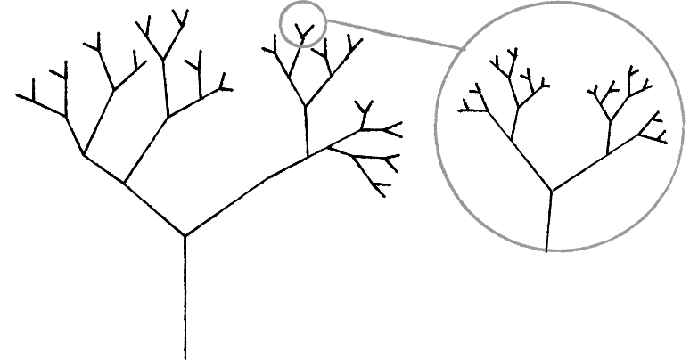

In 1968, a Hungarian botanist named Aristid Lindenmayer developed a grammar-based system to model the growth patterns of plants.   
A Lindenmayer system, or L-System, can be used to model the morphology of a variety of organisms and to generate self-similar fractal patterns.  
As described by [Benoit Mandelbrot](https://en.wikipedia.org/wiki/Benoit_Mandelbrot), a fractal is *"a rough or fragmented geometric shape that can be split into parts, each of which is (at least approximately) a reduced-size copy of the whole"*.  
{: .text-justify}
<br/>

  
Each part of a fractal is a reduced-size copy of the whole. [^1]  
{: style="color:gray; font-size: 80%; text-align: center;"}
<br/>

It is clear that fractals' geometry has a recursive nature, repeating itself in a self-similar way.  
An L-system can be used to define fractals because at its core there is the idea of replacing parts of the whole using a set of replacing rules. It allows for obtaining complex fractals by applying recursion.  
{: .text-justify}

An L-system consists of:  
 1. **An alphabet** composed of symbols that can be used to make strings.  
    For example, with the alphabet "AB", any string in the L-system can only include these two characters.  
 2. **An axiom** consisting of a string (made of symbols from the alphabet). It is the initial state of the system.  
    For example, with the alphabet "AB", some possible axioms are "A", "ABB", or "BAB".  
 3. **Rules**: a collection of production rules that, when applied to each symbol, generates other strings. A rule is made of a *predecessor* and a *successor*.   
    For example, the rule "BB -> ABA" replaces the occurrences of "BB" with "ABA".  
{: .text-justify}  
  
What does it look like in action?    
{: .text-justify}

## A simple example

Let’s begin with a simple L-system: the original Lindenmayer’s L-system for modeling the growth of algae.  
It is defined by:  
{: .text-justify}

 ```pseudocode
    Alphabet:   A B  
    Axiom:      A  
    Rules:     (A → AB), (B → A)  
 ```  

We label the axiom as *Generation 0*, and consider each application of the rules as a new generation. By iteratively applying the rules to each generation we get:  
{: .text-justify}  

 ```pseudocode
    Generation 0:       A  
    Generation 1:       AB  
    Generation 2:       ABA  
    Generation 3:       ABAAB
    Generation 4:       ABAABABA
    
    ...and so on...  
 ```

How can we use this? Well, we can replace each letter of the alphabet with an action, meaning that [we can visually represent the fractal by using drawing instructions](https://en.wikipedia.org/wiki/L-system#Example_2:_Fractal_(binary)_tree).  
However, we are not going to draw fractals here, as **we are interested in hearing them** instead.
{: .text-justify} 

## An example with music

We are going to generate music using the Minor Pentatonic scale. We need to define the L-system first:  
{: .text-justify} 

 ```pseudocode
    Alphabet:   1 2 3 4 5  
    Axiom:      1  
    Rules:     (1 → 52), (2 → 13), (3 -> 24), (4 -> 35), (5 -> 41)  
 ```  

The alphabet is composed by the scale degrees, the axiom is the first degree of the scale, and the rules replace each note with the previous and the next scale degrees.  
The first five generations are:  
{: .text-justify}  

 ```pseudocode
    Generation 0:       1
    Generation 1:       52
    Generation 2:       4113  
    Generation 3:       35525224
    Generation 4:       2441411341131335
    Generation 5:       13353552355252243552522452242441
 ```

If we start playing from C4, here is how this L-system sounds:  
{: .text-justify} 

**Generation 0** 
<audio src="/assets/audio/l-systems/0-LSystem.mp3" controls> Unable to load song. </audio>  
**Generation 1**  
<audio src="/assets/audio/l-systems/1-LSystem.mp3" controls> Unable to load song. </audio>  
**Generation 2**  
<audio src="/assets/audio/l-systems/2-LSystem.mp3" controls> Unable to load song. </audio>  
**Generation 3**  
<audio src="/assets/audio/l-systems/3-LSystem.mp3" controls> Unable to load song. </audio>  
**Generation 4**  
<audio src="/assets/audio/l-systems/4-LSystem.mp3" controls> Unable to load song. </audio>  
**Generation 5**  
<audio src="/assets/audio/l-systems/5-LSystem.mp3" controls> Unable to load song. </audio>  

<br/>
They don't sound like memorable tunes, but the rules can be anything so it is a matter of tuning the system with better rules.  
For example, more sophisticated rules could include the control of rhythm, awareness of phrases, and anything else you can think of.
{: .text-justify}  
<br/>

I hope you found this interesting. See you in the next post!  
{: .text-justify}  
<br/>
    
[^1]:
    Picture from [The Nature of Code](https://natureofcode.com/)
    {: style="color:gray; font-size: 80%;"}
