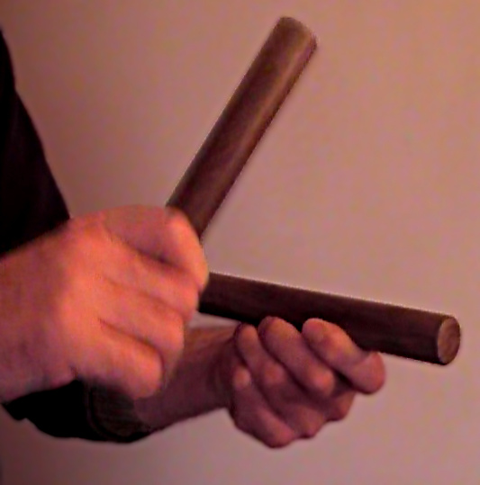
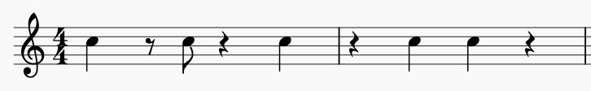
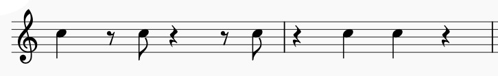
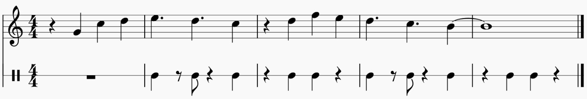

If you are here because you are interested in algorithmic composition, but you are not really into Afro-Cuban music, then chances are that you don't have a clue about what the Clave is.  
If that's the case, then this is the post you were waiting for: it will give you a basic understanding of the Clave.    
Let's start!
{: .text-justify}

## What is the clave?

The clave is a rhythmic pattern at the core of Afro-Cuban music. It is often played on two wood sticks called *Claves*, or on other percussion instruments, and it holds the music's rhythm together.  
{: .text-justify}
 
  
The Claves.  
{: style="color:gray; font-size: 80%; text-align: center;"}
 

The two main clave patterns used in Afro-Cuban music are the son clave and the rumba clave.
You can listen to them here:  
{: .text-justify}

**Son Clave**
<audio src="/assets/audio/music/clave-pattern/son.mp3" controls> Unable to load song. </audio>  
**Rumba Clave**  
<audio src="/assets/audio/music/clave-pattern/rumba.mp3" controls> Unable to load song. </audio>
 

The clave spans over two measures: one of three notes and another of two. It can be played in two ways: 3-2 or 2-3, depending upon which measure is first.  
The two measures are in a relationship of tension-relaxation: the 3 side of the clave is the strong part, the one that creates tension, 
while the 2 side is the weak part, as it creates resolution.  
{: .text-justify} 

  
The 3-2 Son Clave.  
{: style="color:gray; font-size: 80%; text-align: center;"}
  
The 3-2 Rumba Clave.  
{: style="color:gray; font-size: 80%; text-align: center;"}

 
As mentioned before, **the *clave* is at the core of Cuban rhythms, as instrument patterns and melodic phrases build on top of it**.  
{: .text-justify}  

## What does this mean?

Let's look at an example. The following phrase starts with a pick-up, and it's in 3-2 clave.  
{: .text-justify}  
  
<audio src="/assets/audio/music/diana.mp3" controls> Unable to load song. </audio>
 

It is clear that this melody fits well with the clave. However, not all melodies will outline the clave so explicitly.  
As a general rule, in order to determine the direction of the clave, one has to check if the melody has a tendency toward one direction or another.  
This can be achieved by looking for patterns in the melody that resemble the clave.  
{: .text-justify}  
 

The understanding of the clave, and how to arrange rhythmic and melodic patterns with it is an important topic for this blog. Expect more about it in future posts!  
{: .text-justify}
