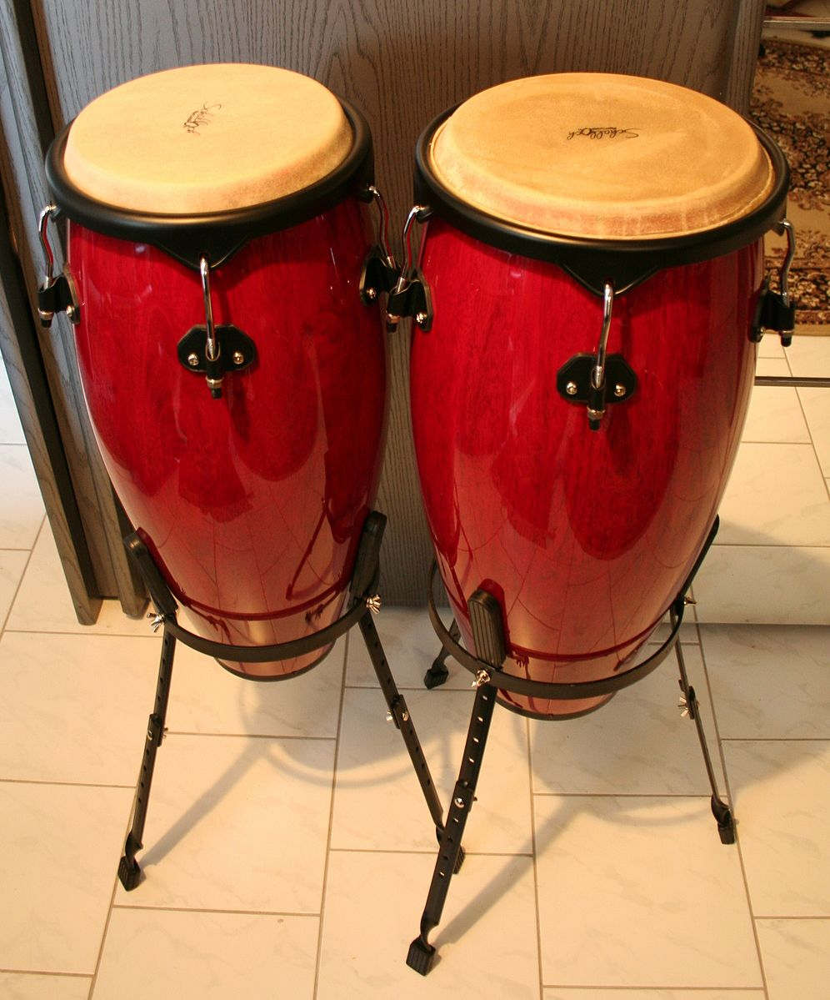
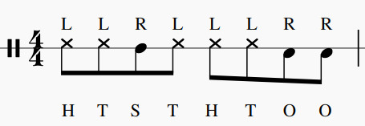
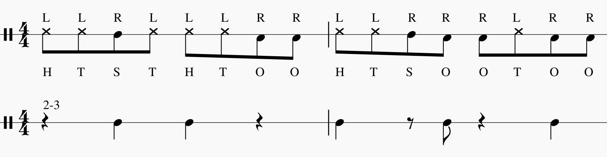

In the [previous post](https://codinginclave.com/2021/the-clave/), I briefly shared with you my recent findings on the clave.
The clave is at the core of the relationships between the instruments of a salsa ensemble, as their rhythm patterns are structured around it.  
The rhythm section instruments in a salsa ensemble include:
 - percussion 
    - timbales
    - congas
    - drumset
    - bells
    - bongos
    - hand percussion
 - bass
 - tres
 - guitar
 - strings
 - piano 

This is the first post in a series that will cover the basics of all of them. Let's start with congas.  
{: .text-justify}

## The instrument
The conga is a family of barrel-shaped drums classified according to their size. A bigger size corresponds to a lower pitch.  
Here is a list of the members of this family, from the largest to the smallest drumhead: 
- the supertumba or rebajador can be as large as 35.5 cm across.
- the tumba or salidor is typically 30.5 to 31.8 cm across.
- the conga or tres dos is typically 29.2 to 30.5 cm across.
- the quinto is typically around 28 cm across.
- the requinto can be smaller than 24.8 cm across.
- the ricardo can be as small as 22.9 cm across.
{: .text-justify}

 
  
A pair of congas. Picture by [Stephan Czuratis](https://commons.wikimedia.org/wiki/File:2006-06-03_Congas1.JPG)
{: style="color:gray; font-size: 80%; text-align: center;"}
 

In a salsa ensemble, the conga player typically plays two or three congas tuned in low, middle, and high pitches.  
They produce numerous tones including the open tone, slap, muffled tone, short bass tone, long or open bass tone, 
and other sounds produced by using the fists, finger-tips, nails, and sticks (on the head and on the side of the drum).  
{: .text-justify}

## The Tumbao
The basic salsa pattern played on the congas is called tumbao. 
It is a one-measure pattern comprised of eight notes. With one hand, the player accents beat 2 with a slap and beats 4 and 4+ with open notes.
All the other notes come from the execution of a "heel-toe" pattern with the other hand.  
When using two congas, the tumbao is played on the higher-pitched drum, while it is played on the middle one when using three.  
{: .text-justify}

 
  
The Tumbao Pattern. The letters on top refer to the hand in use, while the ones at the bottom refer to the kind of stroke.  
{: .text-justify; style="color:gray; font-size: 80%; text-align: center;"}
 

The basic tumbao can be played regardless of the direction of the clave, as it spans only over one measure.  
When played on two congas, the lower drum is used on the 3-side of the clave, accenting the 2+ and/or sometimes beat 3.  
{: .text-justify}  

 
  
The Two-Drum Tumbao Pattern. Accents on the 3-side.  
{: .text-justify; style="color:gray; font-size: 80%; text-align: center;"}
 

There exist many variations of the tumbao, including:
- playing the open tone only on beat 4
- playing the 2+, 4, and 4+ open tones all on the high drum
- accent in every measure the 2+ on the low drum and 4 and 4+ on the high one
- playing beat 3 on the low drum, and 4 and 4+ on the high one 

These variations are generally used a few times, as the conga player has to balance the usage of the basic tumbao with its variations.  
If you are curious to hear congas in action, listen to the following recording. In it, the conga player cycles between two variations of the tumbao:  
{: .text-justify}  

<audio src="/assets/audio/music/conga-pattern/tumbao.mp3" controls> Unable to load song. </audio>  
Recording by [bigjoedrummer](https://freesound.org/people/bigjoedrummer/sounds/214899/)
{: .text-justify; style="color:gray; font-size: 80%; text-align: left;"}
 

That's all for this introduction on conga drums, see you in the next post!  
{: .text-justify}
